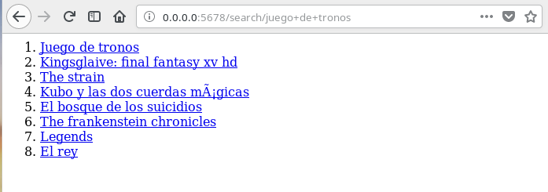
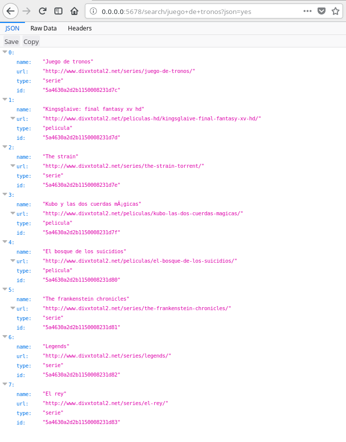
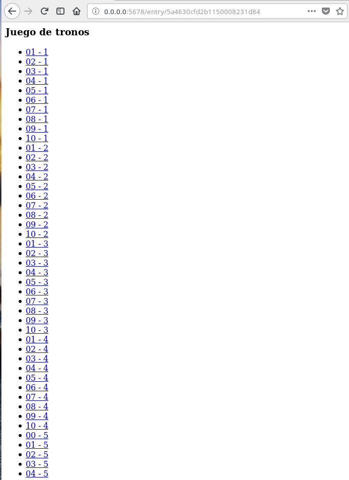
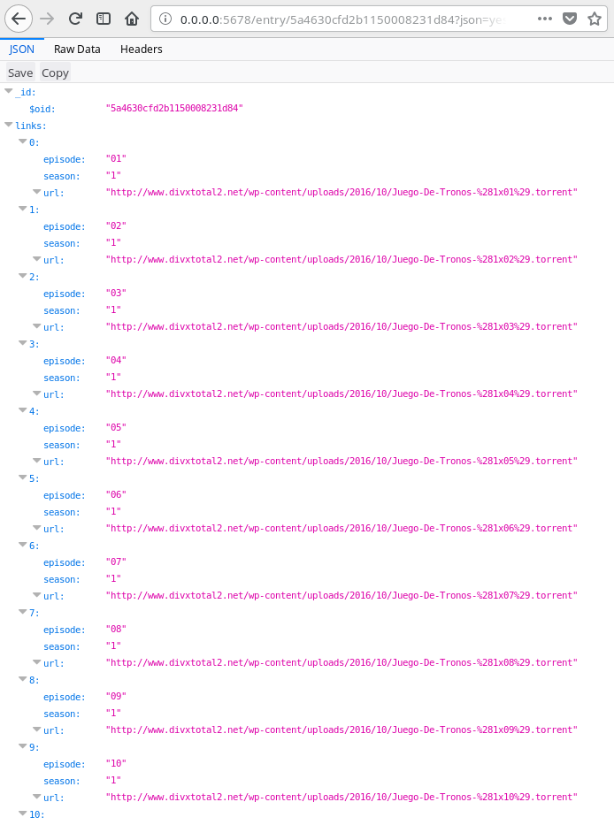

### Dockerized Sinatra / Mongoid App over Puma via Foreman

#### Introducción 

La aplicación ha sido desarrollada según los conocimientos adquiridos en la asignatura **Infraestructura Virtual** impartida en la UGR. 

Su principal funcionamiento es buscar en la web enlaces torrent a series y películas.

Para su desarrollo, se han empleado distintas tecnologías:

* **Ruby** como lenguaje de programación.
* **Sinatra** como framework para la API.
* **Puma** como servidor web Rack.
* **MongoDB** como base de datos.
* **Mongoid** como framework ODM (Object-Document-Mapper).
* **Guard** para TDD
* **Foreman**
* **Travis CI y Rake** para integración continua.
* **Docker** y **Docker Compose**

### Uso

#### Uso básico
* Para correr la aplicación usa `docker-compose up`. 
* Accede a la aplicación en `0.0.0.0:5678`

#### Rutas para el uso de la aplicación
* `0.0.0.0:5678/status` devuelve el estado de la aplicación (JSON)
* `0.0.0.0:5678/search/<nombre>` busca series y películas
* `0.0.0.0:5678/search/<nombre>?json=yes` busca series y películas (Devuelve un JSON con las coincidencias)
* `0.0.0.0:5678/entry/<id>` muestra los enlaces de descarga
* `0.0.0.0:5678/entry/<id>?json=yes` muestra los enlaces de descarga (como JSON)
* `0.0.0.0:5678/all/` muestra la base de datos actual

#### Despliegue en Heroku

Despliegue https://sleepy-brushlands-97842.herokuapp.com/status

#### Despliegue en Zeit

Contenedor https://sptorrent-api-rjakfewbqo.now.sh/status

#### Contenedor en DockerHub

https://hub.docker.com/r/patamimbre/sptorrent-api/

`docker pull patamimbre/sptorrent-api`

#### Despliegue en Azure
Dado que mi aplicación requiere de dos contenedores para funcionar (API y mongodb) **no era posible su correcto despliegue en Zeit o Heroku**. Quedaba claro que necesitaba algo más poderoso, y lo he conseguido creando una máquina virtual. Los pasos están desarrollados en [este documento](https://github.com/patamimbre/IV_Trabajos/blob/master/iaas.md). 

Despliegue final: floral-tree-92.westus.cloudapp.azure.com

#### Funcionamiento

La aplicación se nutre de . Cada vez que se realiza una búsqueda, la API busca directamente en esta web los resultados coincidentes y estos son almacenados en la base de datos local. 

Cada uno de los resultados es guardado con un *ID identificativo*. Cuando se accede a */entry/<ID>*, la aplicación busca los enlaces a la serie indicada y los muestra al usuario.

Los resultados son mostrados en una página web muy simple. Si se desean en *JSON* basta con añadir al final de la dirección web **?json=yes**.

#### Documentos para el despliegue y desarrollo de la aplicación.

[PaaS - Despliegue en Heroku](https://github.com/patamimbre/IV_Trabajos/blob/master/paas.md)

[IaaS - Despliegue en Azure](https://github.com/patamimbre/IV_Trabajos/blob/master/iaas.md)

#### Capturas de pantalla

*Búsqueda*

*Búsqueda (como JSON)*

*Entrada*

*Entrada (como JSON)*

### INFO

No me hago responsable del mal uso de está aplicación. En ningún caso se almacenan archivos en la base de datos.

Made with ❤️ in Granada

